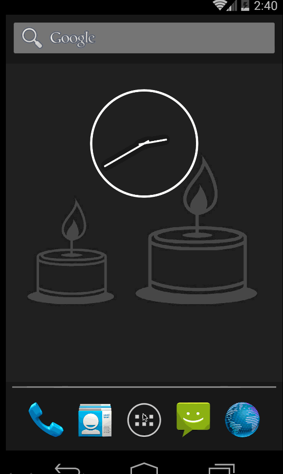

# Final Android project

For this project, you will be writing an Android app that connects to the [iTunes search API](https://www.apple.com/itunes/affiliates/resources/documentation/itunes-store-web-service-search-api.html).  This API does not require any authentication!

Here's an [example query response](https://itunes.apple.com/search?media=music&term=beyonce).

Create a search app that queries the iTunes search API given a search term and displays its results in a ListView.
This assignment is open-ended by design.  Focus on the aesthetics, code quality, query widget functionality, or anything else!

Recommendations: 
* Review ListView, BaseAdapter, Activity
* Use [Retrofit](http://square.github.io/retrofit/) and [Picasso](https://github.com/square/picasso/).
* Use [Android Studio 2.0 Preview](http://android-developers.blogspot.com/2015/11/android-studio-20-preview.html) (with Instant Run!) in order to test your app often!
* As always, be prepared for less-than-complete documentation.  Test often and ask questions!

Extra credit:
* Use a [Navigation View](http://android-developers.blogspot.com/2015/05/android-design-support-library.html) from the Android Design Support Library!

